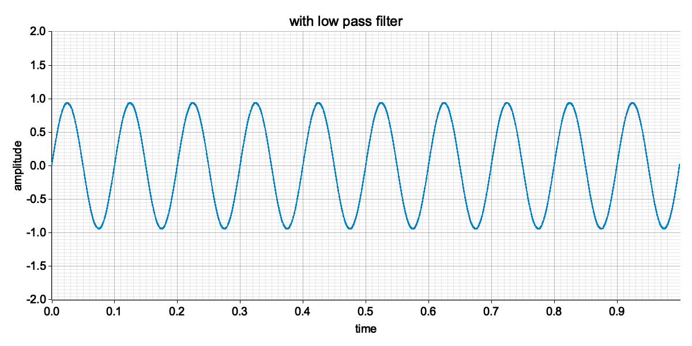

# SIRAS: Signal Processing Library for Rust

<div align="center">
    
</div>

```rust
use nalgebra::DVector;

extern crate siras;
use siras::filter_design::BandType;
use siras::lti::DiscreteTransferFunction;
use siras::signal_generator::generate_sine_wave;

fn main() {
    let sample_rate = 32000;
    let t = DVector::from_fn(sample_rate, |i, _| i as f64 / sample_rate as f64);

    let freq1 = 10.0;
    let freq2 = 100.0;
    let signal = generate_sine_wave(&t, freq1) + generate_sine_wave(&t, freq2);

    let order = 4;
    let dt = 1.0 / sample_rate as f64;
    let cutoff_freq = 20.0;

    let filter = DiscreteTransferFunction::butter(order, cutoff_freq, dt, BandType::LowPass);
    let filtered_signal = filter.filtfilt(&signal, &t);
}
```

# Features

## Filters

<details open>

<summary><b>Butterworth Filter</b></summary>

<div align="center">
    
    
    
</div>

</details>

<details>
<summary><b>Bessel Filter</b></summary>

<div align="center">
    
    
    
</div>

</details>

<details>
<summary><b>Chebyshev Type I Filter</b></summary>

<div align="center">
    
    
    
</div>

</details>

<details>
<summary><b>Chebyshev Type II Filter</b></summary>

<div align="center">
    
    
    
</div>

</details>

## FFT

<details open>
<summary><b>FFT</b></summary>

<div align="center">
    
</div>

### FFT (time domain -> frequency domain)

<div align="center">
    
</div>

### IFFT (frequency domain -> time domain)

<div align="center">
    
</div>

</details>
